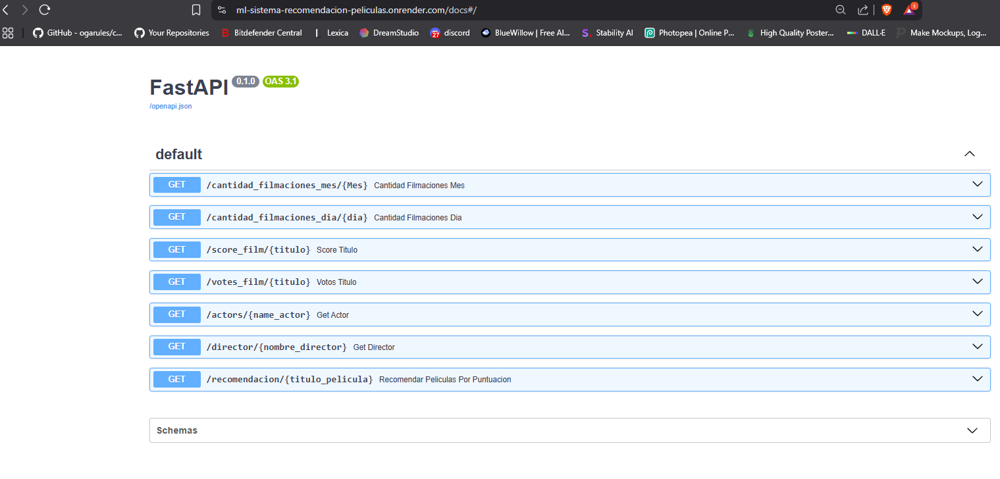

# Sistema de recomendacion de peliculas

## Descripcion

Este proyecto implementa un sitema de recomendacion utilizando tecnicas de Machine Learning . El objetivo es recomendar peliculas en base a un pelicula ya vista o visitada , en la funcion /recomendacion/ dentro del archivo main.py se define comoparametro 'titulo_pelicula' y como retorno las recomendaciones de las 5 peliculas mas parecidas a esa.

## Contenido archivos

- credits.pkl : Este archivo es la data ya limpia y transformada del archivo originas credits.pkl .Este archivo contiene como informacion util el nombre de los actores y directores  en cada peliculas 
- peliculas.pkl : Este archivo es la data ya limpia y transformada del archivo original movies.csv . Este archivo contiene informacion de las peliculas como son:
 * Nombre depelicula
 * Costo
 * Retorno
 * Compañia
 * etc 
 En el archivo Diccionario de Datos.xlsx viene especificado cada una de las columnas
 - ETL: Contiene el codigo de la extraccion , transformacion y caarga de los datos. 
 - Modelo_Recomendacion_EDA : Es el archivo que contiene el codigo en dodne se visualiza la informacionmediante graficas y ademas contiene le codigo del modelo de recomendacion.
 - main.py : Es el archivo que contiene las funciones y que es ejecutado desde render
- requirements.txt :Contiene las bibliotecas utilizadas

## Funciones de main

El api contien un total de 6 funciones las cuales son las siguientes:

- GET /cantidad_filmaciones:Se ingresa un mes en idioma Español. Debe devolver la cantidad de películas que fueron estrenadas en el mes consultado en la totalidad del dataset.
- GET /cantidd_fimaciones_dia: Se ingresa un mes en idioma Español. Debe devolver la cantidad de películas que fueron estrenadas en el dia consultado en la totalidad del dataset.
- GET /score_film : Se ingresa el título de una filmación esperando como respuesta el título, el año de estreno y el score.
- GET /votes_film : Se ingresa el título de una filmación esperando como respuesta el título, la cantidad de votos y el valor promedio de las votaciones. La misma variable deberá de contar con al menos 2000 valoraciones, caso contrario, se regresa un mensaje avisando que no cumple esta condición y que por ende, no se devuelve ningun valor.
- GET /actors : Se ingresa el nombre de un actor que se encuentre dentro de un dataset debiendo devolver el éxito del mismo medido a través del retorno. Además, la cantidad de películas que en las que ha participado y el promedio de retorno.
- GET /director : Se ingresa el nombre de un director que se encuentre dentro de un dataset debiendo devolver el éxito del mismo medido a través del retorno. Además, deberá devolver el nombre de cada película con la fecha de lanzamiento, retorno individual, costo y ganancia de la misma.
- GET /recomendacion : Función para recomendar películas basadas en vecinos mas cercanos

# Render API
- https://ml-sistema-recomendacion-peliculas.onrender.com/docs

### Requisitos

- Python 3.10.0
- Bibliotecas especificadas en `requirements.txt`

## Tecnologias

- Python
- Sckit-learn
- Docker
- Fast Api
- Render
- SQL
- Seaborn
- Matplotlib

## Autor

Rogelio Cortez Rosas

**Contacto**

correo : rcortezrosas@gmail.com

Git hub user : RogerCortezRosas

Linkedin : https://www.linkedin.com/in/rogelio-cortez-rosas

tel : +52 5657047920